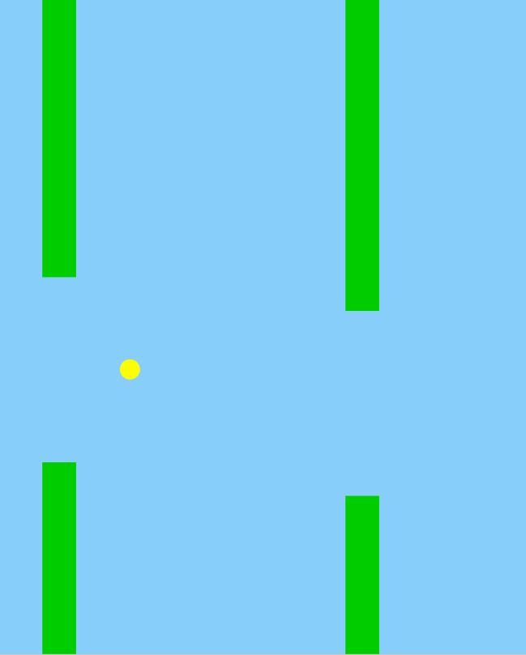

This is my Flappys project that I've made entirely in Java. Here is a video explanation of the project: https://www.youtube.com/watch?v=WTj3d65C6EA The one and only button to play this game is spacebar to jump. To download this project, you first need to have Java 15.0.2 or above. To check what version of Java you have, open CMD and type in exactly "java -version". Here is the Java website to download the latest version of Java https://www.oracle.com/java/technologies/javase-jdk16-downloads.html To download this project
1. Click on code
2. Download zip
3. Open the folder where you downloaded the zip (typically your downloads folder)
4. Right click on the zip
5. Click extract here
6. Open the folder 
7. Go to "out" --> "artifacts" --> "FlappyBird_jar" --> FlappyBird (double click)

Some Screenshots: 

 

